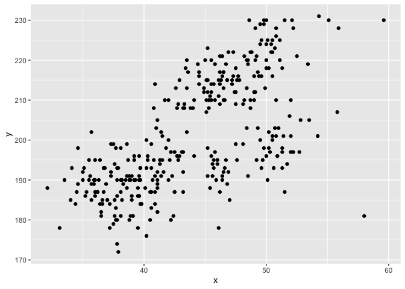

Homework 1
================
Chloe Chah

  - [Problem 1](#problem-1)
  - [Problem 2](#problem-2)

This is my solution to HW 1.

``` r
library(tidyverse)
```

    ## ── Attaching packages ───────────────────────────────────── tidyverse 1.3.0 ──

    ## ✓ ggplot2 3.3.2     ✓ purrr   0.3.4
    ## ✓ tibble  3.0.3     ✓ dplyr   1.0.2
    ## ✓ tidyr   1.1.2     ✓ stringr 1.4.0
    ## ✓ readr   1.3.1     ✓ forcats 0.5.0

    ## ── Conflicts ──────────────────────────────────────── tidyverse_conflicts() ──
    ## x dplyr::filter() masks stats::filter()
    ## x dplyr::lag()    masks stats::lag()

## Problem 1

Create a data frame with the specified elements.

``` r
  prob1_df =
    tibble(
     samp = rnorm(10),
     samp_gt_0 = samp > 0, 
     char_vec = c("a", "b", "c", "d", "e", "f", "g", "h", "i", "j"),
     factor_vec = factor(c("low", "low", "low", "med", "med", "med", "med",      "high", "high", "high"))
    )
```

Take the mean of each variable in my data frame.

``` r
  mean(pull(prob1_df, samp))
```

    ## [1] 0.05156206

``` r
  mean(pull(prob1_df, samp_gt_0))
```

    ## [1] 0.6

``` r
  mean(pull(prob1_df, char_vec))
```

    ## Warning in mean.default(pull(prob1_df, char_vec)): argument is not numeric or
    ## logical: returning NA

    ## [1] NA

``` r
  mean(pull(prob1_df, factor_vec))
```

    ## Warning in mean.default(pull(prob1_df, factor_vec)): argument is not numeric or
    ## logical: returning NA

    ## [1] NA

I can take the mean of numbers and logical but not character or factor.

Now I will show the code chunk that applies the as.numeric function to
the logical, character, and factor variables.

``` r
  as.numeric(pull(prob1_df, samp))
  as.numeric(pull(prob1_df, samp_gt_0))
  as.numeric(pull(prob1_df, char_vec))
```

    ## Warning: NAs introduced by coercion

``` r
  as.numeric(pull(prob1_df, factor_vec))
```

Now I will convert the vectors into different types of variables and
multiply the results by the random sample.

``` r
  as.numeric(pull(prob1_df, samp_gt_0))* pull(prob1_df, samp)
```

    ##  [1] 0.0000000 0.6497499 0.0000000 0.1295531 1.5578789 0.7298780 0.0000000
    ##  [8] 0.0000000 0.1369938 0.8496544

``` r
  as.factor(pull(prob1_df, samp_gt_0))* pull(prob1_df, samp)
```

    ## Warning in Ops.factor(as.factor(pull(prob1_df, samp_gt_0)), pull(prob1_df, : '*'
    ## not meaningful for factors

    ##  [1] NA NA NA NA NA NA NA NA NA NA

``` r
  as.numeric(as.factor(pull(prob1_df, samp_gt_0))* pull(prob1_df, samp))
```

    ## Warning in Ops.factor(as.factor(pull(prob1_df, samp_gt_0)), pull(prob1_df, : '*'
    ## not meaningful for factors

    ##  [1] NA NA NA NA NA NA NA NA NA NA

It seems like we can convert logical variables to numeric variables and
multiply it by a numeric. However, if we can’t convert the variable to a
numeric variable such as for factor or character variables in the first
place, then we also cannot multiply the product of as.numeric function
by a numeric (we got an NA message when we tried to do this in the
previous code chunk). This explains why we were got a warning/error
message that says “argument is not numeric or logical: returning NA\[1\]
NA” when we tried to take the mean of factor and character variables. On
the other hand, it seems like R converted logical variables into 0s and
1s before taking the mean.

## Problem 2

I’ve downloaded a package containing the penguins dataset directly
through the console. I will then load the penguins dataset and run some
in-line codes to get a short description of the dataset.

``` r
  data("penguins", package = "palmerpenguins")
```

  - The dataset contains 344 rows and 8 columns.
  - There are a total of 8 variables in this dataset: species, island,
    bill\_length\_mm, bill\_depth\_mm, flipper\_length\_mm,
    body\_mass\_g, sex, year.
  - There are 3 different species of penguins in the data set: Adelie,
    Gentoo, Chinstrap.
  - There are 3 different islands in the data set: Torgersen, Biscoe,
    Dream.
  - The mean flipper length is 200.9152047mm with a standard deviation
    of 14.0617137mm.
  - The mean bill length is 43.9219298mm with a standard deviation of
    5.4595837mm.
  - The mean bill depth is 17.1511696mm with a standard deviation of
    1.9747932mm.
  - The mean body mass is 4201.754386g with a standard deviation of
    801.9545357g.
  - For more detailed descriptive information of the dataset, please
    refer to the values listed below: Adelie :152 , Chinstrap: 68 ,
    Gentoo :124 , NA, NA, NA, NA, Biscoe :168 , Dream :124 , Torgersen:
    52 , NA, NA, NA, NA, Min. :32.10 , 1st Qu.:39.23 , Median :44.45 ,
    Mean :43.92 , 3rd Qu.:48.50 , Max. :59.60 , NA’s :2 , Min. :13.10 ,
    1st Qu.:15.60 , Median :17.30 , Mean :17.15 , 3rd Qu.:18.70 , Max.
    :21.50 , NA’s :2 , Min. :172.0 , 1st Qu.:190.0 , Median :197.0 ,
    Mean :200.9 , 3rd Qu.:213.0 , Max. :231.0 , NA’s :2 , Min. :2700 ,
    1st Qu.:3550 , Median :4050 , Mean :4202 , 3rd Qu.:4750 , Max. :6300
    , NA’s :2 , female:165 , male :168 , NA’s : 11 , NA, NA, NA, NA,
    Min. :2007 , 1st Qu.:2007 , Median :2008 , Mean :2008 , 3rd Qu.:2009
    , Max. :2009 , NA

Now I will create a scatterplot.

``` r
  plot_df = tibble(
    x = penguins$bill_length_mm, 
    y = penguins$flipper_length_mm,
    z = penguins$species
  )
  
  plot_1 = ggplot(penguins, aes(x=bill_length_mm, y = flipper_length_mm, color = species)) + geom_point()
  
  plot_1
```

    ## Warning: Removed 2 rows containing missing values (geom_point).

<!-- -->

``` r
  ggsave("plot_1.pdf", height = 4, width = 6)
```

    ## Warning: Removed 2 rows containing missing values (geom_point).
